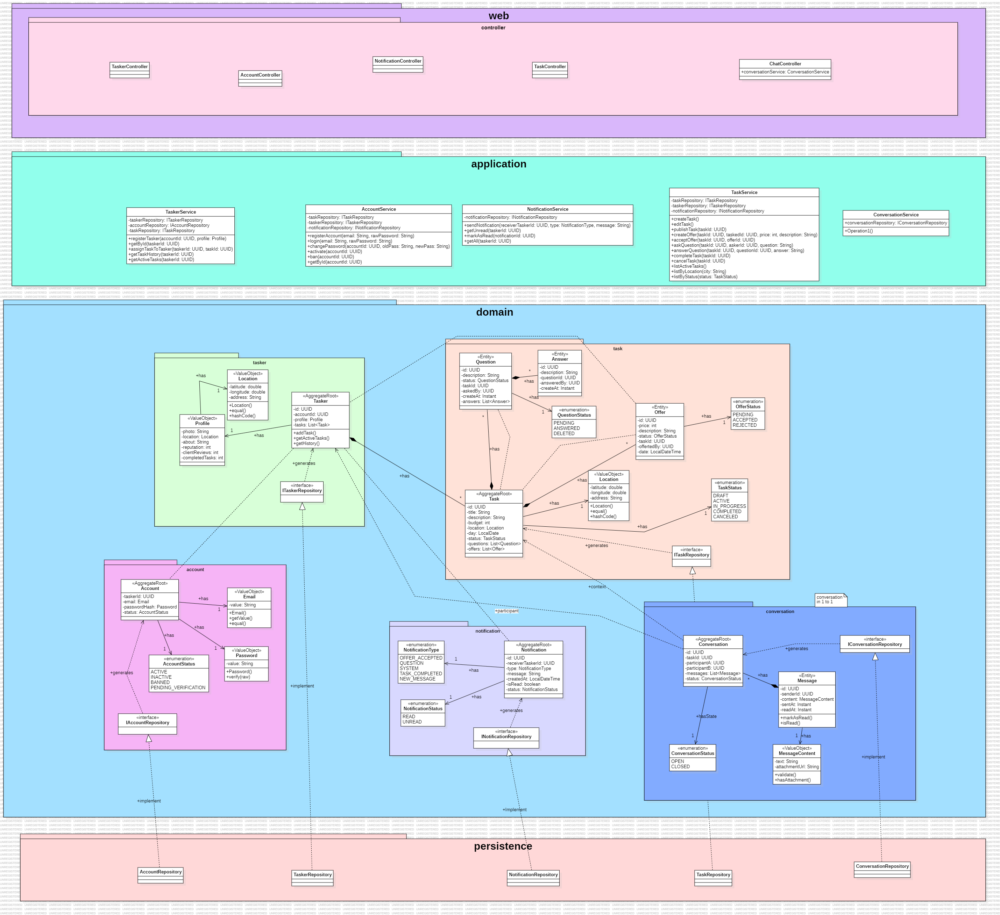

# Fast Tasker

## backend architecture with DDD

Endpoints
---

## Authentication

| Action | HTTP Method | Endpoint | Description |
| :--- | :--- | :--- | :--- |
| Register a new user | POST | `/auth/register` | Creates a user profile (for posters or taskers). |
| Login a user | POST | `/auth/login` | Authenticates a user and returns a JWT token. |

## Tasker

| Action                                | HTTP Method | Endpoint                | Description                                        |
|:--------------------------------------|:------------|:------------------------|:---------------------------------------------------|
| Register a newtasker's profile        | PUT         | `/tasker/user/register` | Register Tasker Profile.                           |
| Get current tasker's profile          | GET         | `/tasker/user/me`       | Retrieves the profile of the authenticated tasker. |
| Update current tasker's profile       | PUT         | `/tasker/user/me`       | Updates the profile of the authenticated tasker.   |
| Get a specific tasker's profile       | GET         | `/tasker/{userId}`      | Retrieves the public profile of any tasker.        |

## Tasks

| Action               | HTTP Method | Endpoint                 | Description                                       |
|:---------------------|:------------|:-------------------------|:--------------------------------------------------|
| Create a new task    | POST        | `/tasks`                 | A "poster" creates a new task to be done.         |
| List available tasks | GET         | `/tasks`                 | Lists all public tasks. Supports filtering.       |
| Get a specific task  | GET         | `/tasks/{taskId}`        | Retrieves the full details of a single task.      |
| Update a task        | PUT         | `/tasks/{taskId}`        | The owner updates their task (before assignment). |
| Cancel a task        | DELETE      | `/tasks/{taskId}`        | The owner cancels their task.                     |
| Assign a task        | POST        | `/tasks/{taskId}/assign` | The owner assigns the task to a specific tasker.  |

## Offers

| Action                  | HTTP Method | Endpoint                           | Description                                     |
|:------------------------|:------------|:-----------------------------------|:------------------------------------------------|
| Make an offer on a task | POST        | `/tasks/{taskId}/offers`           | A "tasker" places a bid on a task.              |
| List offers for a task  | GET         | `/tasks/{taskId}/offers`           | The task owner lists all offers for their task. |
| Withdraw an offer       | DELETE      | `/tasks/{taskId}/offers/{offerId}` | A "tasker" removes their offer from a task.     |

## Questions

| Action                    | HTTP Method | Endpoint                                     | Description                                            |
|:--------------------------|:------------|:---------------------------------------------|:-------------------------------------------------------|
| Ask a question on a task  | POST        | `/tasks/{taskId}/questions`                  | Any authenticated user posts a question on a task.     |
| List questions for a task | GET         | `/tasks/{taskId}/questions`                  | Retrieves all questions (and answers) for a task.      |
| Answer a question         | POST        | `/tasks/{taskId}/questions/{questionId}/answers` | The task owner posts an answer to a specific question. |
| Delete a question         | DELETE      | `/tasks/{taskId}/questions/{questionId}`     | The user who asked the question can delete it.         |
| Delete an answer          | DELETE      | `/tasks/{taskId}/questions/{questionId}/answers/{answerId}` | The task owner can delete their answer.                |

## Reviews

| Action                  | HTTP Method | Endpoint                  | Description                                    |
|:------------------------|:------------|:--------------------------|:-----------------------------------------------|
| Create a review         | POST        | `/reviews`                | A user reviews another after a completed task. |
| List reviews for a user | GET         | `/users/{userId}/reviews` | Lists all reviews received by a specific user. |

---